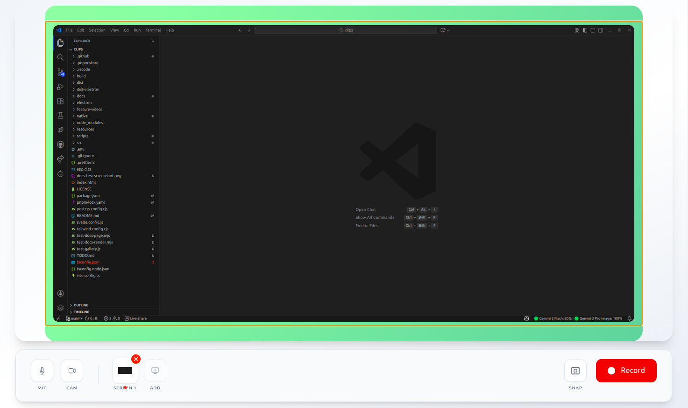

Clip Flow is a high-fidelity screen recording and editing studio. This project is built on top of the open-source repository [clips](https://github.com/FormidableLabs/clips). It preserves the original goals while adding more control over recording, camera, microphone, and post-processing.

The application uses an Electron frontend with a native Rust backend to enable reliable global mouse/keyboard tracking and high-performance desktop capture.

## Feature Gallery

Explore all features with interactive screenshots: **[Features Gallery](https://erkamkavak.github.io/screen-recorder/)**

[](https://erkamkavak.github.io/screen-recorder/)

## Features

### Recording

- **Native Capture:** Screen and window capture implemented in Rust for improved performance and reliability.
- **Selection & Preview:** Screen share source selection with a live preview during the recording session.
- **Webcam Integration:** Camera capture with a draggable overlay and various layout controls.
- **Audio Handling:** Microphone capture and integrated audio processing.
- **Notes Overlay:** Support for multiple notes during recording with shortcut-based switching.
- **Floating Controls:** External recorder overlay allowing start/stop actions while focused on other applications.
- **Screenshot Export:** One-click functionality to export a preview screenshot.
- **Project Management:** Projects list to store and reopen previous recordings.

### Editing & Review

- **Review Workflow:** Dedicated post-processing stage with a timeline, segment management, and trimming.
- **Smart Zoom:** Click-to-zoom functionality and timeline-based zoom events with cursor-following logic.
- **Cursor Customization:** Options to highlight or replace the cursor, including support for importing custom cursor packs.
- **Visual Styling:** Customizable backgrounds (solids, gradients, images) and visual themes.
- **Captions:** Automated transcription pipeline with adjustable caption styling (size, color, visibility).

### Export

- **Export Options:** Pipeline supporting MP4 (H.264), WebM (VP9) formats.
- **Presets:** Predefined resolution and frame-rate settings for exported files.
- **Render Control:** Real-time render progress tracking with support for canceling operations.

## Technology Stack

- **UI:** built using [Svelte](https://svelte.dev/).
- **Desktop Integration:** [Electron](https://www.electronjs.org/).
- **Native Layer:** [Rust](https://www.rust-lang.org/) via [napi-rs](https://napi.rs/) using [xcap](https://crates.io/crates/xcap) for cross-platform capture.
- **Rendering:** Canvas-based pipeline utilizing [WebCodecs](https://developer.mozilla.org/en-US/docs/Web/API/WebCodecs_API).

## Prerequisites

- Node.js (v18+) and pnpm
- Rust toolchain (for building the native module)
- `ffmpeg` available on your PATH

## Running locally

Install dependencies and build the native Rust module, then start the app:

```bash
pnpm install
pnpm build:native
pnpm dev
```

## Platform Support

- Developed and tested primarily on **Linux (X11)** and **Windows**.
- macOS support is experimental.
- On **Linux**, mouse cursor shape tracking currently requires **X11**.

### Linux system requirements

To build the native Rust module (e.g. `xcap` and related crates) on Linux, you may need to install additional system packages.

- **Debian / Ubuntu**:
  
  ```bash
  sudo apt-get install pkg-config libclang-dev libxcb1-dev libxrandr-dev libdbus-1-dev libpipewire-0.3-dev libwayland-dev libegl-dev
  ```
  
- **Alpine**:
  
  ```bash
  sudo apk add pkgconf llvm19-dev clang19-dev libxcb-dev libxrandr-dev dbus-dev pipewire-dev wayland-dev mesa-dev
  ```

- **Arch Linux**:
  
  ```bash
  sudo pacman -S base-devel clang libxcb libxrandr dbus libpipewire
  ```

## Contributing

This is my first maintained open-source project. I will be really happy if you:

- Open issues for bugs, crashes, or confusing behavior
- Suggest improvements to the recording pipeline, post-processing, or platform support

Feedback and contributions (even small ones) are very welcome.
